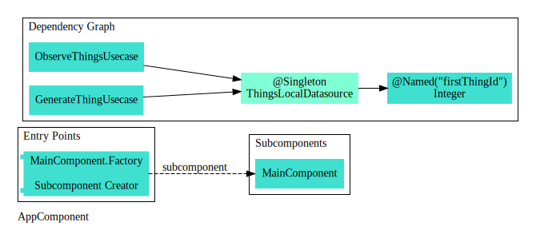
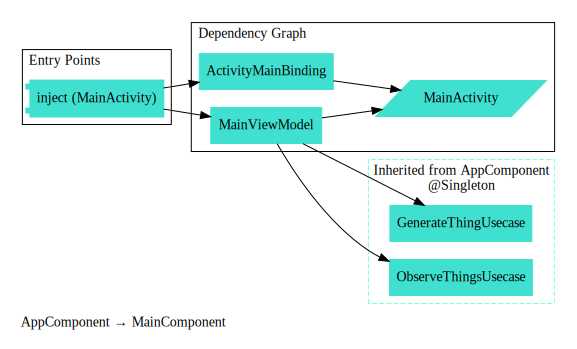

The following is a contrived example application that incorporates 
Kotlin, Dagger, Coroutines, Flow & Channel, ViewModel, and LiveData.  
It has two primary features:
1. generate Things by clicking a button
2. observe Things as they are created. 

This suggests two use cases, GenerateThingUsecase and ObserveThingsUsecase, 
that act on a Thing entity.

```kotlin
data class Thing(val id : Int)

interface GenerateThingUsecase {
    suspend fun generateThing()
}

interface ObserveThingsUsecase {
    fun observeThings(): Flow<Thing>
}
```

We can implement both of these use cases with a single class, ThingsLocalDatasource.
In reality there could be one or more remote services responsible for this, and there might be one
or more datasources acting as adapters between the remote services and the use cases.

```kotlin
class ThingsLocalDatasource(var currentId : Int, val fakeDelay: Long)
    : ObserveThingsUsecase, GenerateThingUsecase {
    private val thingChannel = Channel<Thing>()

    override suspend fun generateThing() {
        withContext(Dispatchers.IO) { thingChannel.send(Thing(currentId++)) }
    }

    override fun observeThings() : Flow<Thing> {
        return thingChannel.receiveAsFlow().onEach { delay(fakeDelay) }.flowOn(Dispatchers.IO)
    }
}
```

Next we define a ViewModel to:
1) mediate ui events from our main view (MainActivity) and
2) broadcast data events (from our use cases) that our view can respond to.

To accomplish this, our ViewModel constructor requires instances of both use cases (described above).
```kotlin
class MainViewModel(
    private val observeThings : ObserveThingsUsecase,
    private val generateThing : GenerateThingUsecase
) : ViewModel() {
    fun generateThingButtonClicked() { viewModelScope.launch { generateThing.generateThing() } }
    val thingLiveData = observeThings.observeThings().asLiveData()
}
```

The MainActivity can now focus on:
1) sending button clicks to the ViewModel (using ViewBinding) and
2) setting text when data changes are observed (using LiveData)

Initializing ViewBinding and ViewModel instances requires boilerplate that we can delegate
our dependency provider (Dagger) to inject when `inject(this)` is called.

```kotlin
class MainActivity : AppCompatActivity() {
    @Inject lateinit var viewBinding : ActivityMainBinding
    @Inject lateinit var viewModel : MainViewModel

    override fun onCreate(savedInstanceState: Bundle?) {
        super.onCreate(savedInstanceState)
        (application as App).component.mainFactory().create(this)
            .inject(this)

        viewBinding.generateThingButton.setOnClickListener {
            viewModel.generateThingButtonClicked()
        }

        viewModel.thingLiveData.observe(this, Observer {
            viewBinding.textView.text = "$it"
        })
    }
}

```
Now we can use Dagger to generate the graph of dependencies needed to fulfill the @Inject requests above.
In the Application class we initialize a Dagger AppComponent that
binds a @Singleton instance of ThingsLocalDatasource as the implementation for both ObserveThingUsecase and GenerateThingUsecase.
Notice both the AppModule and ThingModule are required to fully build the component.  
If either one were removed we would get a "missing dependency" compiler error.

Note: the reference to MainComponent will be explained in the following step.

```kotlin
class App : Application(), FeatureOneComponent.Provider {
    val component by lazy { DaggerAppComponent.factory().create() }
}

@Component(modules = [AppModule::class, ThingModule::class])
@Singleton
interface AppComponent {
    @Component.Factory
    interface Factory {
        fun create() : AppComponent
    }

    fun mainFactory() : MainComponent.Factory
}

@Module(subcomponents = [MainComponent::class])
class AppModule {
    @Provides @Named("firstThingId") fun provideThingId() : Int = 2
}

@Module
class ThingModule {
    @Provides
    @Singleton
    fun ThingsLocalDatasource(@Named("firstThingId") thingId : Int) : ThingsLocalDatasource = ThingsLocalDatasource(thingId, 1000L)

    @Provides
    fun ObserveThingsUsecase(datasource: ThingsLocalDatasource) : ObserveThingsUsecase = datasource

    @Provides
    fun AddThingUsecase(datasource: ThingsLocalDatasource) : GenerateThingUsecase = datasource
}
```
### [Code Diagram](https://c4model.com/#CodeDiagram) of Injected Object Dependencies for AppComponent


The component above will likely be useful to several views in our application, but for now we will
use it only to set up our main view. We create a MainComponent as a Subcomponent of AppComponent so it can inherit dependencies from the
parent's modules (ThingModule, AppModule above) as well as create some of its own (MainModule below).  Exposing it's
factory thru the AppComponent interface (mainFactory() method on the AppComponent interface above) makes this possible.

Note: Jetpack ViewModels are lifecycle-aware and thus have special conventions for their initialization.
We must use a ViewModelProvider.Factory.

```kotlin
@Subcomponent(modules = [MainModule::class])
interface MainComponent {
    fun inject(mainActivity: MainActivity)

    @Subcomponent.Factory
    interface Factory {
        fun create(@BindsInstance activity: MainActivity) : MainComponent
    }
}

@Module
class MainModule {
    @Provides
    fun ActivityMainBinding(activity: MainActivity): ActivityMainBinding {
        return ActivityMainBinding.inflate(activity.layoutInflater)
            .apply { activity.setContentView(root) }
    }
    @Provides
    fun MainViewModel(
        activity : MainActivity,
        observeThings: ObserveThingsUsecase,
        generateThing: GenerateThingUsecase
    ): MainViewModel {
        return ViewModelProvider(
            activity,
            object: ViewModelProvider.Factory {
                override fun <T : ViewModel?> create(modelClass: Class<T>): T {
                    return if (modelClass.isAssignableFrom(MainViewModel::class.java)) {
                        MainViewModel(observeThings, generateThing) as T
                    } else {
                        throw IllegalArgumentException("Unknown ViewModel Class")
                    }
                }
            }
        ).get(MainViewModel::class.java)
    }
}
``` 

### [Code Diagram](https://c4model.com/#CodeDiagram) of Injected Object Dependencies for MainComponent


### [Component Diagram](https://c4model.com/#ComponentDiagram) of Local Module Dependencies (Gradle)
Green boxes are Android Modules, red boxes are JVM modules, and orange boxes are Kotlin Multiplatform modules.  Arrows point to the dependency. 


### [Component Diagram](https://c4model.com/#ComponentDiagram) of Remote Module Dependencies (Gradle)
White boxes are local modules, orange boxes are remote modules. Transitive dependencies are excluded. Arrows point to the dependency.

