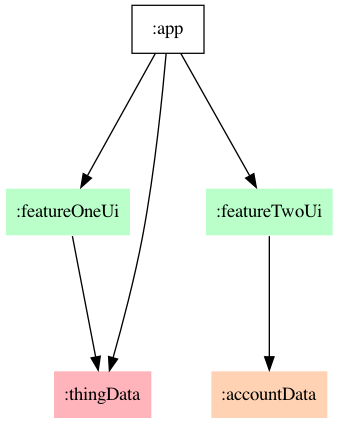
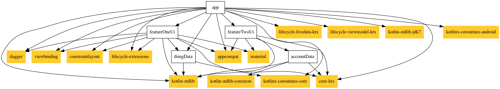

The following is a contrived example application that incorporates 
Dagger, Kotlin, Coroutines, Flow & Channel, ViewModel, LiveData, ViewBinding, and Navigation. 
 
It has two primary features:
1. generate Things by clicking a button
2. observe Things that are created. 

This suggests two use cases, GenerateThingUsecase and ObserveThingsUsecase, 
that act on a Thing entity.

```kotlin
data class Thing(val id : Int)

interface GenerateThingUsecase {
    suspend fun generateThing()
}

interface ObserveThingsUsecase {
    fun observeThings(): Flow<Thing>
}
```

We can implement both of these use cases with a single class, ThingsLocalDatasource.
In reality there could be one or more remote services responsible for this, and there might be one
or more datasources acting as adapters between the remote services and the use cases.

```kotlin
class ThingsLocalDatasource(var currentId : Int, val fakeDelay: Long)
    : ObserveThingsUsecase, GenerateThingUsecase {
    private val thingChannel = Channel<Thing>()

    override suspend fun generateThing() {
        withContext(Dispatchers.IO) { thingChannel.send(Thing(currentId++)) }
    }

    override fun observeThings() : Flow<Thing> {
        return thingChannel.receiveAsFlow().onEach { delay(fakeDelay) }.flowOn(Dispatchers.IO)
    }
}
```

Next we define an AddThingViewModel to:
1) mediate ui events (e.g. "Add Thing" button clicked) from a view, and
2) broadcast data events (new Thing was generated) that a view can respond to.

To accomplish this, our ViewModel constructor requires instances of both use cases (described above).
```kotlin
class AddThingViewModel @Inject constructor(
    private val observeThings : ObserveThingsUsecase,
    private val generateThing : GenerateThingUsecase,
) : ViewModel() {
    fun generateThingButtonClicked() { viewModelScope.launch { generateThing.generateThing() } }
    val thingLiveData = observeThings.observeThings().asLiveData()
}
```

The AddThingLayout view can now focus only on:
1) sending button click events to a ViewModel and
2) setting display text when ViewModel data changes are observed

```kotlin
class AddThingLayout(context: Context, attributeSet: AttributeSet) : ConstraintLayout(context, attributeSet) {
    @Inject @FromStore lateinit var viewModel : AddThingViewModel
    @Inject lateinit var lifecycleOwner: LifecycleOwner
    private val binding by lazy { AddThingLayoutBinding.bind(this) }

    override fun onAttachedToWindow() {
        super.onAttachedToWindow()
        if (isInEditMode) return
        appComponent().addThingFactory().create(this).inject(this)
        viewModel.thingLiveData.observe(lifecycleOwner, Observer {
            binding.textView.text = "$it"
        })
        binding.generateThingButton.setOnClickListener {
            viewModel.generateThingButtonClicked()
        }
    }
}
```
Now we can use Dagger to generate the graph of dependencies needed to fulfill the @Inject requests above.
In the Application class we initialize a Dagger AppComponent that
binds a @Singleton instance of ThingsLocalDatasource as the implementation for both ObserveThingUsecase and GenerateThingUsecase.
Notice both the AppModule and ThingModule are required to fully build the component.  
If either one were removed we would get a "missing dependency" compiler error.

Note: the reference to `addThingFactory()` will be explained in the following step.

```kotlin
class App : Application(), FeatureOneComponent.Provider {
    val component by lazy { DaggerAppComponent.factory().create() }
}

@Module
class AppModule {
    @Provides
    @Named("firstThingId") fun provideThingId() : Int = 1

    @dagger.Component(modules = [AppModule::class, ThingModule::class])
    @Singleton
    interface Component {
        @dagger.Component.Factory
        interface Factory {
            fun create(@BindsInstance @Named("appContext") appContext: Context) : Component
        }

        fun addThingFactory() : AddThingModule.Component.Factory
    }
}

@Module
class ThingModule {
    @Provides
    @Singleton
    fun ThingsLocalDatasource(@Named("firstThingId") thingId : Int) : ThingsLocalDatasource = ThingsLocalDatasource(thingId, 1000L)

    @Provides
    fun ObserveThingsUsecase(datasource: ThingsLocalDatasource) : ObserveThingsUsecase = datasource

    @Provides
    fun AddThingUsecase(datasource: ThingsLocalDatasource) : GenerateThingUsecase = datasource
}
```
### [Code Level Diagram](https://c4model.com/#CodeDiagram) of Injected Object Dependencies for AppComponent
A slanted box indicates a binding instance ([@BindsInstance](https://dagger.dev/api/2.28/dagger/BindsInstance.html)) passed into the component through the factory or builder. 


The component above will likely be useful to several views in our application, but for now we will
use it only to set up our first view. We create a AddThingModule.Component as a @Subcomponent of AppComponent so it can inherit dependencies from the
parent's modules (ThingModule, AppModule above) as well as create some of its own.  Exposing it's
factory thru the AppComponent interface (addThingFactory() method on the AppComponent interface above) makes this possible.

```kotlin
@Module
class AddThingModule {
    @Provides
    fun LifecycleOwner(view: View) : LifecycleOwner = view.findFragment()

    @Provides
    @FromStore
    fun ViewModel(view: View, provider : Provider<AddThingViewModel>) = provider.fromStore(view.findFragment())

    @Subcomponent(modules = [AddThingModule::class])
    interface Component {
        fun inject(addThingLayout: AddThingLayout)

        @Subcomponent.Factory
        interface Factory {
            fun create(@BindsInstance view: View) : Component
        }
    }
}
``` 

Note: Jetpack ViewModels are lifecycle-aware and thus have special conventions for their initialization.
We must use a `androidx.lifecycle.ViewModelProvider` so that the view model can be paused, reused, and 
only recreated when required by the lifecycle.  The `fromStore()` extension method encapsulates the 
typical approach we want to use for this.  Since `AddThingViewModel` has an @Inject annotated constructor,
we use a Dagger `Provider` as an object that knows *how* to create new view model and the `ViewModelStoreOwner`
will decide *when* to create it.   

### [Code Level Diagram](https://c4model.com/#CodeDiagram) of Injected Object Dependencies for AddThingModule.Component


### [Component Level Diagram](https://c4model.com/#ComponentDiagram) of Local Module Dependencies
The components in this diagram are Gradle modules. Green boxes are Android Modules, red boxes are JVM modules, and orange boxes are Kotlin Multiplatform modules.  Arrows point to the dependency. 



### [Component Level Diagram](https://c4model.com/#ComponentDiagram) of Remote Module Dependencies 
The components in this diagram are Gradle modules.  White boxes are local modules, orange boxes are remote modules. Transitive dependencies are excluded. Arrows point to the dependency.

